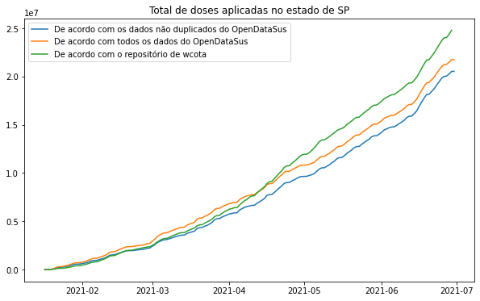

# Organização de dados sobre a imunização da covid-19 no Brasil

O objetivo deste repositório é centralizar os dados de vacinação contra a covid-19 no Brasil, agregá-los e disponibilizá-los para proporcionar acesso unificado e eficaz. 

Os dados agregados fornecem uma contagem separada por unidade federativa e data que contém as seguintes informações: idade da pessoa imunizada, sexo da pessoa, grupo de atendimento (critério que permitiu que aquela pessoa fosse vacinada, como faixa etária ou profissão), nome da vacina aplicada e se é a primeira dose ou a segunda.

Os dados são coletados através da API do [OpenDataSUS](https://opendatasus.saude.gov.br/dataset/covid-19-vacinacao).

Este repositório está em fase de validação. Não há garantia sobre a consistência e manutenção das informações apresentadas. 

## Conteúdo

Este repositório é composto por duas seções:

* `src`: O código-fonte do script usado para acessar, processar e salvar os dados.
* `data`: Os dados coletados. 

Para acessar a documentação de cada uma das seções, entre no diretório correspondente. 

## Limitações

Alguns problemas foram encontrados para fazer este trabalho de organização de dados. Se você tem sugestões para colaborar, entre em contato [pelo formulário](https://forms.gle/1Yvy67id5pPteGzz9) ou pela seção `Issues`.

### Inconsistências

Alguns microdados possuem inconsistências claras, por exemplo: uma amostra informa que a pessoa tem 90 anos mas vacinou por estar no grupo prioritário de 60 a 65 anos. Esses problemas são dos dados do OpenDataSus e provavelmente refletem erros na coleta de dados. Nos dados agregados disponibilizados neste repositório, esses erros são mantidos porque não é possível recuperar os valores corretos.

### Duplicidades

Nos microdados obtidos do OpenDataSus, cada paciente possui um código identificador. Um problema observado é que muitos IDs aparecem de forma duplicada, como se a mesma pessoa tivesse sido vacinada várias vezes. Os dados com IDs duplicados foram separados, pois se considera que as informações que eles contém podem estar incorretas. Esse problema afeta cerca de 20% dos microdados. Veja a documentação dos dados para mais informações. 

### Atraso

Em alguns testes, os dados de vacinados dos últimos 14 dias forneceram um total de vacinados muito inferior ao esperado. Isso pode ser um indicativo de atraso na disponibilização de dados do OpenDataSus. 

### Discordância

Os dados obtidos não necessariamente concordam com outras fontes. Por exemplo, o repositório de [wcota](https://github.com/wcota/covid19br), que não dá detalhes sobre como coleta os dados, registra um número de vacinados diferente, como mostra o gráfico abaixo. O atraso de dados do OpenDataSus também contribui muito para essa diferença. 

### Dados locais

Apenas os dados do estado de São Paulo estão disponíveis neste repositório. Isto é uma limitação temporária porque o método usado ainda está sendo validado. 

Se você precisa de dados de um estado específico, envie uma mensagem [neste formulário](https://forms.gle/1Yvy67id5pPteGzz9) ou em `Issues`. 

## Uso

Você pode usar como quiser os dados e o código-fonte disponibilizados. Se você pretende fazer acessos automatizados, preencha [este formulário](https://forms.gle/1Yvy67id5pPteGzz9) para ser avisado de eventuais mudanças que possam afetar a automatização. 

Esteja ciente das limitações descritas na seção anterior, e que podem haver outros erros não identificados. Não existe qualquer garantia para o conteúdo fornecido. 

Caso queira citar a fonte dos dados, use o próprio endereço do repositório. 